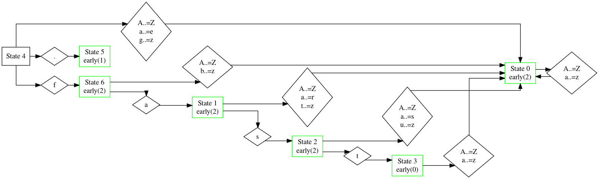

# Debugging

Instructions on how to debug your Logos lexer.

## Visualizing Logos Graph

Logos works by creating a graph that gets derived from
the tokens that you defined.
This graph describes how the lexer moves through different
states when processing input.

Hence, it may be beneficial during debugging to be able to
visualize this graph, to understand how Logos will match the various tokens.

If we take this example:

```rust,no_run,noplayground
use logos::Logos;

#[derive(Debug, Logos, PartialEq)]
enum Token {
    // Tokens can be literal strings, of any length.
    #[token("fast")]
    Fast,

    #[token(".")]
    Period,

    // Or regular expressions.
    #[regex("[a-zA-Z]+")]
    Text,
}
fn main() {
    let input = "Create ridiculously fast Lexers.";

    let mut lexer = Token::lexer(input);
    while let Some(token) = lexer.next() {
        println!("{:?}", token);
    }
}
```

and compile with the `debug` feature, we can see debugging information about
the regex compilation and resulting state machine. First, it outputs a list of
the "leaves", or different patterns that can be matched by the state machine. A
leaf is generated for each `#[token(...)]` and `#[regex(...)]` attribute.

```
  0: #[token("fast")] ::Fast (priority: 8)
  1: #[token(".")] ::Period (priority: 2)
  2: #[regex("[a-zA-Z]+")] ::Text (priority: 2)
```

Next, the debug representation of the DFA is printed. For more information on decoding this, see the [`regex-cli` docs](https://docs.rs/crate/regex-cli/latest). Lastly, the actual graph that that the generated rust code follows is printed (this is usually slightly different than the `regex-automata` graph due to various optimizations that are applied). For our above example, it looks like this:

```
  state0 => StateData(early(2) ) {
    A..=Z|a..=z => state0
  }
  state1 => StateData(early(2) ) {
    A..=Z|a..=r|t..=z => state0
    s => state2
  }
  state2 => StateData(early(2) ) {
    A..=Z|a..=s|u..=z => state0
    t => state3
  }
  state3 => StateData(early(0) ) {
    A..=Z|a..=z => state0
  }
  state4 => StateData() {
    A..=Z|a..=e|g..=z => state0
    . => state5
    f => state6
  }
  state5 => StateData(early(1) ) {
  }
  state6 => StateData(early(2) ) {
    A..=Z|b..=z => state0
    a => state1
  }

  Root node: State(4)
```

This graph can help us understand how our patterns are matched,
and maybe understand why we have a bug at some point.

Let's get started by trying to understand how Logos is matching the
`.` character, which we've tokenized as `Token::Period`.

We can begin our search by looking at state `4`, as that is the root node.
We can see that if Logos matches a `.` it will jump `=>` to state `5`.
We can then follow that by looking at `state5` which resolves leaf `1`, which
we saw earlier as corresponding to the `Token::Period` variant.

> [!INFO]
>
> If you are curious why it says `early(1)`, that is because this is an early
> match. A "late" match means that the current character is not part of the
> returned token. Usually this is because the current character is the imaginary
> end-of-file character, used for matching patterns that end in `$`.

Logos would also continue to look for any matches past our `.` character.
However, since there is not another leaf that could possibly match, it instead
stops. This is indicated by the fact that there are no "next state" edges
within `state5`.

We also can try to identify how the token `fast` works by looking at `4`,
first, and seeing that `f` will cause Logos to jump to `6`, then `a` to `1`,
`s` to `2`, and finally, `t` to `3`. In this state, you can see that there is a
match for leaf `0`, but also a continuation to `state0`. This will be taken if
the lexer is passed something like `faster`, which will be eventually lexed to
a `Token::Text` token instead.

## Visual Representation

Logos can generate Mermaid charts and DOT graphs to visualize the lexer’s state
transitions.

Specify an export directory with the `export_dir` attribute to save these graphs:

```rust,no_run,noplayground
#[derive(Logos)]
#[logos(export_dir = "path/to/export/dir")]
enum Token {
    #[token("fast")]
    Fast,

    #[token(".")]
    Period,

    #[regex("[a-zA-Z]+")]
    Text,
}
```

You can also specify the name of the file to export to.

```rust,no_run,noplayground
#[logos(export_dir = "export/graph.mmd")]
```

To render the graphs, you can install a plugin in your IDE or use an online tool.

See the [graphviz](https://graphviz.org/doc/info/command.html) and
[mermaid](https://mermaid.js.org/config/usage.html) documentations for more
details.



> [!INFO]
>
> This graphviz graph has been modified with the graph attribute `rankdir="LR";`
> to make it fit better on screen.

## Enabling

To enable debugging output you can define a `debug` feature in your
`Cargo.toml` file, like this:

```
// Cargo.toml
[dependencies]
logos = { version = "1.2.3", features = ["debug"] }
```

Next, you can build your project with `cargo build` and
the output will contain a debug representation of your graph(s).
